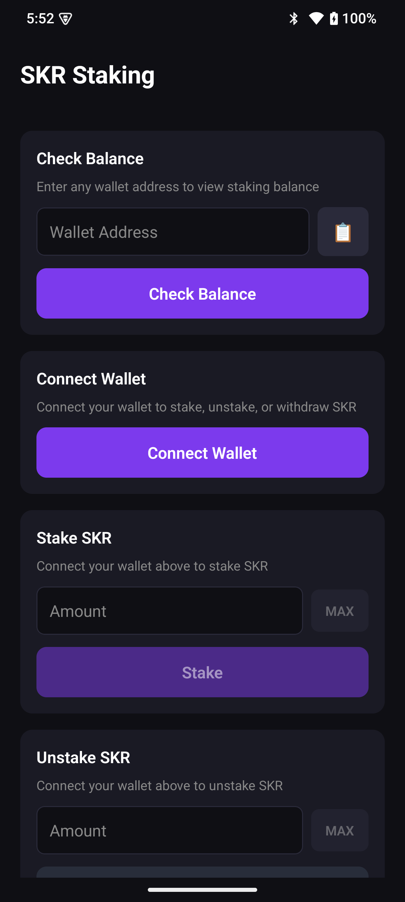
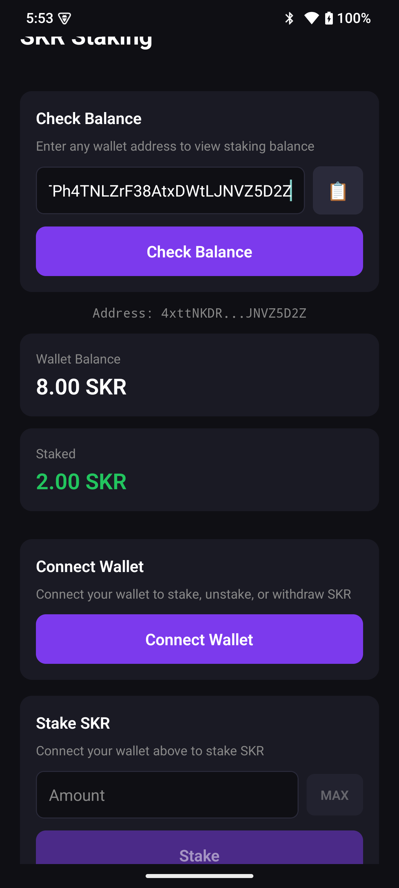
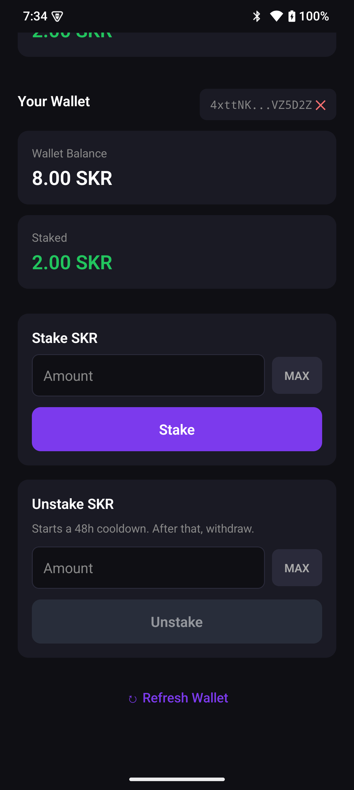
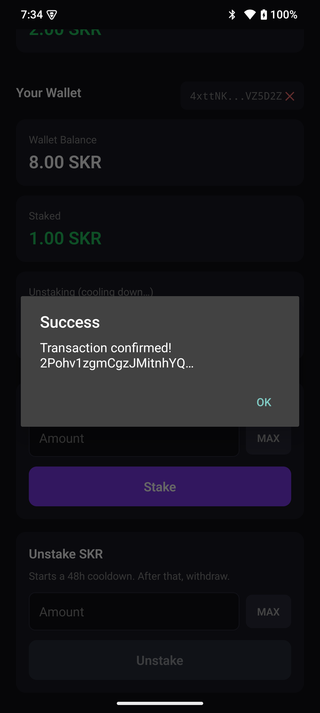
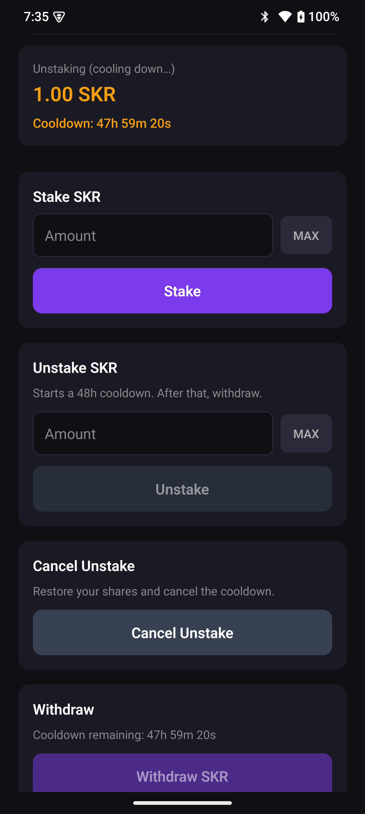

# StakeSKR

A sample React Native app demonstrating SKR token staking on Solana using Mobile Wallet Adapter.

## What is this?

StakeSKR is a **demo application** that shows how to integrate the [Seeker Staking Program](https://solscan.io/account/SKRskrmtL83pcL4YqLWt6iPefDqwXQWHSw9S9vz94BZ) into a React Native mobile app. It implements the full staking lifecycle — stake, unstake, cancel unstake, and withdraw — using [Codama](https://github.com/codama-idl/codama)-generated TypeScript clients and [Solana Web3.js v2](https://github.com/anza-xyz/kit) (`@solana/kit`). The app connects to user wallets via [Mobile Wallet Adapter](https://docs.solanamobile.com/getting-started/overview) and runs on Solana mainnet.

## Screenshots & Demo

|                     Main Screen                    |                           SKR Balance                           |
| :------------------------------------------------: | :-------------------------------------------------------------: |
|  |  |


|                     Stake Tokens                    |                     Unstake Tokens                    |                        Cancel / Withdraw                        |
| :-------------------------------------------------: | :---------------------------------------------------: | :-------------------------------------------------------------: |
|  |  |  |


## Using SKR Staking functionality in Your App

This sample app is built for developers who want to integrate SKR staking into their own apps. Common use cases include:

- **Query a user's staked SKR balance** to gate features or boost in-app rewards (e.g., users with 1,000+ SKR staked get 2x points)
- **Display staking analytics** — show staked amount, unstaking status, and cooldown timers
- **In-app staking** — let users stake and unstake SKR directly from your app without leaving to an external tool

The two most common integration points are read-only queries (no wallet connection needed):

1. **Get SKR wallet balance** — how much unstaked SKR a user holds ([see Get SKR Balance](#get-skr-balance))
2. **Get staked amount** — how much SKR a user has staked with a guardian ([see Get Stake Amount](#get-stake-amount))

Both can be called with just a wallet address. No wallet connection or transaction signing required.

## Project Structure

```
StakeSKR/
├── src/
│   ├── app/
│   │   ├── _layout.tsx          # Root layout with MobileWalletProvider
│   │   └── index.tsx            # Main staking screen (all staking logic)
│   └── generated/
│       └── staking/             # Codama-generated client (DO NOT EDIT)
│           ├── accounts/        # Account fetchers (StakeConfig, UserStake)
│           ├── instructions/    # Instruction builders (stake, unstake, etc.)
│           ├── programs/        # Program address & identifiers
│           ├── types/           # Event type definitions
│           └── errors/          # Program error codes
├── program/
│   └── idl.json                 # Anchor IDL for the staking program
├── codama.json                  # Codama configuration
└── package.json
```

## Tech Stack

- React Native 0.81 + Expo SDK 54
- TypeScript (strict mode)
- Expo Router (file-based navigation)
- Solana Web3.js v2 (`@solana/kit`)
- `@wallet-ui/react-native-kit` (Mobile Wallet Adapter)
- Codama (TypeScript client generation from Anchor IDL)

## Setup

```bash
git clone <repo-url>
cd StakeSKR
npm install
cp .env.example .env
```

Edit `.env` and set your RPC URL:

```
EXPO_PUBLIC_RPC_URL=https://your-rpc-provider.com
```

The public Solana RPC (`https://api.mainnet-beta.solana.com`) is rate-limited, use a dedicated provider like [Helius](https://helius.dev), [QuickNode](https://quicknode.com), or [Triton](https://triton.one).

Then build and run:

```bash
npx expo prebuild --clean
npx expo run:android
```

## How Staking Works

**Program ID:**

```
SKRskrmtL83pcL4YqLWt6iPefDqwXQWHSw9S9vz94BZ
```

**Key constants used in this app:**

```typescript
const SKR_MINT = address('SKRbvo6Gf7GondiT3BbTfuRDPqLWei4j2Qy2NPGZhW3');
const STAKE_CONFIG_ADDRESS = address('4HQy82s9CHTv1GsYKnANHMiHfhcqesYkK6sB3RDSYyqw');
const STAKE_VAULT_ADDRESS = address('8isViKbwhuhFhsv2t8vaFL74pKCqaFPQXo1KkeQwZbB8');
const GUARDIAN_POOL_ADDRESS = address('DPJ58trLsF9yPrBa2pk6UaRkvqW8hWUYjawe788WBuqr');

const SKR_DECIMALS = 6;
const SHARE_PRICE_SCALE = BigInt(1_000_000_000); // 1e9
```

**Staking lifecycle:**

1. **Stake** — Transfer SKR tokens to the vault, receive shares.
2. **Unstake** — Burn shares, start cooldown (48h by default). Token amount is locked at the current share price.
3. **Cancel Unstake** — Restore shares and cancel cooldown (before it expires).
4. **Withdraw** — After cooldown, transfer tokens from the vault back to the user's wallet.

### PDA Derivation

The program uses Program Derived Addresses to locate on-chain accounts:

**UserStake PDA** — one per user per guardian pool:

```typescript
import { getAddressEncoder, getProgramDerivedAddress, getUtf8Encoder } from '@solana/kit';
import { STAKING_PROGRAM_ADDRESS } from '../generated/staking/programs';

async function deriveUserStake(
  stakeConfig: Address,
  user: Address,
  guardianPool: Address,
): Promise<Address> {
  const addrEnc = getAddressEncoder();
  const [pda] = await getProgramDerivedAddress({
    programAddress: STAKING_PROGRAM_ADDRESS,
    seeds: [
      getUtf8Encoder().encode('user_stake'),
      addrEnc.encode(stakeConfig),
      addrEnc.encode(user),
      addrEnc.encode(guardianPool),
    ],
  });
  return pda;
}
```

**StakeConfig PDA** — singleton, seeded with `"stake_config"`.

### Helpers

SKR uses 6 decimals. Share prices are scaled by 1e9. The app includes helpers for converting between raw amounts, display amounts, and shares:

```typescript
// Convert a human-readable SKR amount (e.g. 100.5) to raw on-chain units
function skrToRaw(amount: number): bigint {
  return BigInt(Math.round(amount * 10 ** SKR_DECIMALS));
}

// Convert raw on-chain units to human-readable
function rawToSkr(raw: bigint): number {
  return Number(raw) / 10 ** SKR_DECIMALS;
}

// Convert shares to token amount using the current share price
function sharesToTokens(shares: bigint, sharePrice: bigint): number {
  const rawTokens = (shares * sharePrice) / SHARE_PRICE_SCALE;
  return rawToSkr(rawTokens);
}

// Convert a token amount to shares using the current share price
function tokensToShares(tokenAmount: number, sharePrice: bigint): bigint {
  const raw = skrToRaw(tokenAmount);
  return (raw * SHARE_PRICE_SCALE) / sharePrice;
}
```

## Core Staking Functions

### Get SKR Balance

Reads the user's SPL token balance from their Associated Token Account.

**What it does:** Derives the user's ATA for the SKR mint, then calls `getTokenAccountBalance` via RPC.

**Parameters:** `walletAddress` — the user's wallet `Address`

**Returns:** The token balance as a `number` (human-readable, e.g. `1500.25`)

```typescript
import { address, createSolanaRpc } from '@solana/kit';

const rpc = createSolanaRpc('https://api.mainnet-beta.solana.com');
const SKR_MINT = address('SKRbvo6Gf7GondiT3BbTfuRDPqLWei4j2Qy2NPGZhW3');

// Derive the Associated Token Address
async function findAssociatedTokenAddress(owner: Address, mint: Address): Promise<Address> {
  const addrEnc = getAddressEncoder();
  const [pda] = await getProgramDerivedAddress({
    programAddress: address('ATokenGPvbdGVxr1b2hvZbsiqW5xWH25efTNsLJA8knL'),
    seeds: [
      addrEnc.encode(owner),
      addrEnc.encode(address('TokenkegQfeZyiNwAJbNbGKPFXCWuBvf9Ss623VQ5DA')),
      addrEnc.encode(mint),
    ],
  });
  return pda;
}

// Fetch balance
const ata = await findAssociatedTokenAddress(walletAddress, SKR_MINT);
const tokenBal = await rpc
  .getTokenAccountBalance(ata, { commitment: 'confirmed' })
  .send();
const balance = Number(tokenBal.value.uiAmount ?? 0);
```

### Get Stake Amount

Reads the user's staked balance from the on-chain `UserStake` account.

**What it does:** Derives the `UserStake` PDA, fetches the account using the Codama-generated `fetchMaybeUserStake`, and converts shares to tokens using the current share price from `StakeConfig`.

**Parameters:** `walletAddress` — the user's wallet `Address`

**Returns:** An object with staked balance, unstaking amount, and cooldown status.

**Account derivations:** Requires both `StakeConfig` (for share price) and `UserStake` PDA (for user's shares).

```typescript
import { fetchMaybeStakeConfig, fetchMaybeUserStake } from '../generated/staking/accounts';

// 1. Fetch global config for share price
const configAcct = await fetchMaybeStakeConfig(rpc, STAKE_CONFIG_ADDRESS);
const sharePrice = configAcct.exists ? configAcct.data.sharePrice : SHARE_PRICE_SCALE;
const cooldownSeconds = configAcct.exists ? Number(configAcct.data.cooldownSeconds) : 172_800;

// 2. Derive and fetch UserStake PDA
const userStakePda = await deriveUserStake(
  STAKE_CONFIG_ADDRESS,
  walletAddress,
  GUARDIAN_POOL_ADDRESS,
);

const userAcct = await fetchMaybeUserStake(rpc, userStakePda);

if (userAcct.exists) {
  const data = userAcct.data;
  const stakedBalance = sharesToTokens(data.shares, sharePrice);
  const unstakingAmount = rawToSkr(data.unstakingAmount);

  // Check cooldown status
  const now = BigInt(Math.floor(Date.now() / 1000));
  const unstakingReady = data.unstakingAmount > 0n
    && now >= data.unstakeTimestamp + BigInt(cooldownSeconds);
}
```

### Stake

Transfers SKR tokens from the user's wallet to the staking vault and mints shares.

**What it does:** Builds a `stake` instruction using the Codama-generated `getStakeInstructionAsync`, then sends it via Mobile Wallet Adapter.

**Parameters:**
- `amount` — number of SKR tokens to stake (human-readable)
- `userAddress` — the connected wallet's `Address`

**Accounts involved:**
- `StakeConfig` — global staking configuration
- `GuardianPool` — the guardian pool to delegate to
- `UserStake` PDA — created automatically if first stake
- User's ATA — source of tokens
- `StakeVault` — destination of tokens

**How it interacts with the program:** The program calculates shares as `amount * SHARE_PRICE_SCALE / sharePrice`, transfers tokens from the user's ATA to the vault, and updates the user's share balance.

```typescript
import { getStakeInstructionAsync } from '../generated/staking/instructions';

const rawAmount = skrToRaw(amount);   // e.g. skrToRaw(100) → 100_000_000n
const userATA = await findAssociatedTokenAddress(userAddress, SKR_MINT);

// Dummy signer for Codama type compatibility — MWA signs externally
const dummySigner = {
  address: userAddress,
  signTransactions: async (txs: any) => txs,
} as unknown as TransactionSigner;

const instruction = await getStakeInstructionAsync({
  stakeConfig: STAKE_CONFIG_ADDRESS,
  guardianPool: GUARDIAN_POOL_ADDRESS,
  payer: dummySigner,
  user: userAddress,
  userTokenAccount: userATA,
  stakeVault: STAKE_VAULT_ADDRESS,
  mint: SKR_MINT,
  program: STAKING_PROGRAM_ADDRESS,
  amount: rawAmount,
});

// Strip signer metadata before sending via MWA
const stripped = {
  ...instruction,
  accounts: instruction.accounts?.map(acc => ({
    address: acc.address,
    role: acc.role,
  })),
};

const signature = await sendTransaction([stripped]);
```

### Unstake

Burns shares and initiates a cooldown period. The token amount is calculated and locked at the time of unstake.

**What it does:** Converts a token amount to shares, builds an `unstake` instruction, and sends it via MWA. After the cooldown period (48h default), the user can call `withdraw`.

**Parameters:**
- `amount` — number of SKR tokens to unstake (human-readable)
- `userAddress` — the connected wallet's `Address`
- `sharePrice` — current share price from `StakeConfig` (needed for share conversion)

**Accounts involved:**
- `UserStake` PDA — the user's staking account
- `StakeConfig` — for share price and cooldown
- `GuardianPool` — the delegated guardian

**How it interacts with the program:** The program burns the specified shares, records `unstakingAmount` (calculated as `shares * sharePrice / SHARE_PRICE_SCALE`), and sets `unstakeTimestamp` to the current time. The tokens remain in the vault until withdrawal.

```typescript
import { getUnstakeInstructionAsync } from '../generated/staking/instructions';

const shares = tokensToShares(amount, sharePrice);
const userStakePda = await deriveUserStake(
  STAKE_CONFIG_ADDRESS,
  userAddress,
  GUARDIAN_POOL_ADDRESS,
);

const instruction = await getUnstakeInstructionAsync({
  userStake: userStakePda,
  stakeConfig: STAKE_CONFIG_ADDRESS,
  guardianPool: GUARDIAN_POOL_ADDRESS,
  user: dummySigner,
  stakeVault: STAKE_VAULT_ADDRESS,
  mint: SKR_MINT,
  program: STAKING_PROGRAM_ADDRESS,
  shares,
});
```

### Cancel Unstake

Restores shares and cancels the cooldown. Only available while cooldown is active.

```typescript
import { getCancelUnstakeInstructionAsync } from '../generated/staking/instructions';

const instruction = await getCancelUnstakeInstructionAsync({
  userStake: userStakePda,
  stakeConfig: STAKE_CONFIG_ADDRESS,
  guardianPool: GUARDIAN_POOL_ADDRESS,
  user: dummySigner,
  stakeVault: STAKE_VAULT_ADDRESS,
  program: STAKING_PROGRAM_ADDRESS,
});
```

### Withdraw

Transfers tokens from the vault back to the user's wallet after cooldown completes.

**Accounts involved:** The user's ATA must exist. The app creates it idempotently before calling withdraw.

```typescript
import { getWithdrawInstructionAsync } from '../generated/staking/instructions';

// Ensure ATA exists (idempotent create)
const createATAIx = {
  programAddress: address('ATokenGPvbdGVxr1b2hvZbsiqW5xWH25efTNsLJA8knL'),
  accounts: [
    { address: userAddress, role: 3 /* WRITABLE_SIGNER */ },
    { address: userATA, role: 1 /* WRITABLE */ },
    { address: userAddress, role: 0 /* READONLY */ },
    { address: SKR_MINT, role: 0 /* READONLY */ },
    { address: address('11111111111111111111111111111111'), role: 0 },
    { address: address('TokenkegQfeZyiNwAJbNbGKPFXCWuBvf9Ss623VQ5DA'), role: 0 },
  ],
  data: new Uint8Array([1]), // CreateIdempotent
};

const withdrawIx = await getWithdrawInstructionAsync({
  userStake: userStakePda,
  user: userAddress,
  stakeVault: STAKE_VAULT_ADDRESS,
  userTokenAccount: userATA,
  program: STAKING_PROGRAM_ADDRESS,
});

const signature = await sendTransaction([createATAIx, withdrawIx]);
```

## Transaction Flow

All staking operations follow the same pattern in this app:

1. Build instructions using Codama-generated async functions.
2. Strip signer metadata from accounts (MWA provides its own signer).
3. Send via `sendTransaction()` from `useMobileWallet()`.
4. Poll `getSignatureStatuses` for confirmation.

This is implemented in the `buildAndSend` function in [`src/app/index.tsx`](src/app/index.tsx):

```typescript
const buildAndSend = async (
  buildInstructions: (user: Address) => Promise<Instruction[]>,
  actionType: ActionType,
) => {
  const rawInstructions = await buildInstructions(connectedWalletAddress);

  // Strip signer metadata — MWA adds its own signer
  const instructions = rawInstructions.map(ix => ({
    ...ix,
    accounts: ix.accounts?.map(acc => ({
      address: acc.address,
      role: acc.role,
    })),
  }));

  const signature = await sendTransaction(instructions);

  // Poll for confirmation
  for (let i = 0; i < 30; i++) {
    await sleep(1000);
    const { value: statuses } = await rpc
      .getSignatureStatuses([signature])
      .send();
    if (statuses?.[0]?.confirmationStatus) break;
  }
};
```

## Mobile Wallet Adapter Integration

The wallet provider is configured in [`src/app/_layout.tsx`](src/app/_layout.tsx):

```typescript
import { MobileWalletProvider, createSolanaMainnet } from '@wallet-ui/react-native-kit';

const cluster = createSolanaMainnet({
  url: 'https://api.mainnet-beta.solana.com',
  label: 'Solana Mainnet',
});

export default function Layout() {
  return (
    <MobileWalletProvider cluster={cluster} identity={{ name: 'SKR Staking Example App' }}>
      <Slot />
    </MobileWalletProvider>
  );
}
```

In the staking screen, the `useMobileWallet()` hook provides:

- `connect()` — opens the wallet app for authorization
- `disconnect()` — ends the session
- `sendTransaction(instructions)` — builds, signs (via wallet), and sends a transaction
- `account` — the connected wallet's address

**Dummy signers:** Codama-generated instruction builders expect `TransactionSigner` types for payer/user accounts. Since MWA handles signing externally, the app creates dummy signers that satisfy the type system without actually signing:

```typescript
function makeDummySigner(addr: Address): TransactionSigner {
  return {
    address: addr,
    signTransactions: async (txs: any) => txs,
  } as unknown as TransactionSigner;
}
```

After building instructions, signer metadata is stripped before passing to `sendTransaction()` so MWA can attach its own signer.

## Anchor Program Integration

### Retrieving the IDL

The staking program's Anchor IDL is publicly available on-chain:

1. Go to [Solscan - Program IDL](https://solscan.io/account/SKRskrmtL83pcL4YqLWt6iPefDqwXQWHSw9S9vz94BZ#programIdl)
2. Scroll to the bottom of the page
3. Click "Program IDL"
4. Download the JSON file
5. Save it to `program/idl.json` in the project root

The IDL defines all instructions, accounts, types, events, and error codes for the staking program.

### Generating Clients with Codama

[Codama](https://github.com/codama-idl/codama) generates fully-typed TypeScript (and Rust) clients from Anchor IDL files. This replaces manual instruction building and account deserialization.

**Install dependencies:**

```bash
npm install -D codama @codama/nodes-from-anchor @codama/renderers-js
```

For Rust client generation, also install:

```bash
npm install -D @codama/renderers-rust
```

**Initialize Codama:**

```bash
npx codama init
```

This creates a `codama.json` configuration file in the project root.

**Configure `codama.json`:**

```json
{
    "idl": "program/idl.json",
    "before": [],
    "scripts": {
        "js": {
            "from": "@codama/renderers-js",
            "args": [
                "src/generated/staking"
            ]
        },
        "rust": {
            "from": "@codama/renderers-rust",
            "args": [
                "clients/rust/src/generated",
                {
                    "crateFolder": "clients/rust",
                    "formatCode": true
                }
            ]
        }
    }
}
```

| Field | Description |
|---|---|
| `idl` | Path to the Anchor IDL JSON file |
| `before` | Codama transforms to apply before rendering (empty = none) |
| `scripts.js.from` | The renderer package for JavaScript/TypeScript output |
| `scripts.js.args` | Output directory for generated JS client files |
| `scripts.rust.from` | The renderer package for Rust output |
| `scripts.rust.args` | Output directory and options for generated Rust client |

**Generate the TypeScript client:**

```bash
npx codama run js
```

This generates typed account fetchers, instruction builders, type definitions, and program constants into `src/generated/staking/`.

**Generate the Rust client (optional):**

```bash
npx codama run rust
```

### What Gets Generated

After running `npx codama run js`, the `src/generated/staking/` directory contains:

| Directory | Contents | Example Exports |
|---|---|---|
| `accounts/` | Account fetchers and decoders | `fetchMaybeStakeConfig()`, `fetchMaybeUserStake()` |
| `instructions/` | Async instruction builders | `getStakeInstructionAsync()`, `getUnstakeInstructionAsync()` |
| `programs/` | Program address and identifiers | `STAKING_PROGRAM_ADDRESS` |
| `types/` | Event type definitions with codecs | `Staked`, `Unstaked`, `Withdrawn` |
| `errors/` | Program error codes | Error code `6004` = `CooldownNotCompleted` |

### Using Generated Code in React Native

Import directly from the generated directory:

```typescript
// Account fetchers
import {
  fetchMaybeStakeConfig,
  fetchMaybeUserStake,
} from '../generated/staking/accounts';

// Instruction builders
import {
  getStakeInstructionAsync,
  getUnstakeInstructionAsync,
  getWithdrawInstructionAsync,
  getCancelUnstakeInstructionAsync,
} from '../generated/staking/instructions';

// Program address
import { STAKING_PROGRAM_ADDRESS } from '../generated/staking/programs';
```

The generated code is compatible with `@solana/kit` (Solana Web3.js v2) and uses its `Address`, `TransactionSigner`, and `Instruction` types.

## Program Error Codes

| Code | Name | Description |
|---|---|---|
| 6000 | `InvalidCommissionRate` | Commission must be 0–10,000 basis points |
| 6001 | `InvalidCooldownPeriod` | Cooldown must be greater than zero |
| 6002 | `InsufficientStakeAmount` | Below minimum required stake |
| 6003 | `GuardianPoolInactive` | Guardian pool is not active |
| 6004 | `CooldownNotCompleted` | Cooldown period has not elapsed |
| 6005 | `InvalidSharePrice` | Share price cannot be zero |
| 6006 | `InsufficientShares` | Not enough shares to unstake |
| 6017 | `WithdrawRequired` | Must withdraw before unstaking again |
| 6019 | `NothingToWithdraw` | No unstaking amount available |


## ❗ Fix Codama JSON / Config Import Error

If running:

```bash
npx codama run js
```

throws errors like:

```
Unexpected token 'export'
Failed to load configuration file
To load an ES module, set "type": "module"
```

## ✅ Do This Instead

Don’t use `codama run`.
Generate the client using a TypeScript script.

### 1️⃣ Create `generate-client.ts`

```ts
import { createFromRoot } from "codama";
import { rootNodeFromAnchor } from "@codama/nodes-from-anchor";
import { renderVisitor } from "@codama/renderers-js";
import anchorIdl from "./program/idl.json";

const codama = createFromRoot(rootNodeFromAnchor(anchorIdl));
codama.accept(renderVisitor("src/generated/staking"));
```

### 2️⃣ Run:

```bash
npx tsx generate-client.ts
```
This avoids ESM + JSON import issues and works correctly.


## Resources

- [Solana Mobile Documentation](https://docs.solanamobile.com/)

- [Codama — Client Generation from IDL](https://github.com/codama-idl/codama)
- [Codama — Coming from Anchor](https://github.com/codama-idl/codama?tab=readme-ov-file#coming-from-anchor)
- [@solana/kit (Web3.js v2)](https://github.com/anza-xyz/kit)
- [Mobile Wallet Adapter](https://docs.solanamobile.com/getting-started/overview)
- [Staking Program on Solscan](https://solscan.io/account/SKRskrmtL83pcL4YqLWt6iPefDqwXQWHSw9S9vz94BZ)
